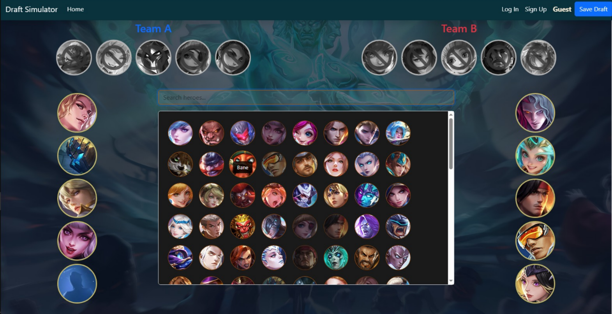

# Mobile Legends Draft Pick Website

#### Video Demo:  https://youtu.be/WSQidGXNb8M

## Overview

A web-based Mobile Legends: Bang Bang (MLBB) draft pick simulator built with Flask and SQLite.  
It allows users to log in, sign up, and experience a realistic hero draft system — ensuring heroes cannot be picked twice or chosen if banned.



---

## 🚀 Features
- **User Authentication** – Secure login and signup system using Flask sessions.  
- **Real Draft Logic** – Ensures that once a hero is picked or banned, it cannot be selected again.  
- **Dynamic Interface** – Simple and responsive HTML frontend.  
- **SQLite Database** – Lightweight, easy-to-use local database for user and draft data.  

---

## 🧩 Tech Stack
| Component | Technology |
|------------|-------------|
| Backend | Flask (Python) |
| Database | SQLite |
| Frontend | HTML, CSS |
| Hosting | Flask built-in server (for local use) |

---

## 🛠️ Installation

### 1. Clone the Repository
```bash
git clone https://github.com/yourusername/mlbb-draft-picker.git
cd mlbb-draft-picker
```

### 2. Install Dependencies
```bash
pip install -r requirements.txt
```

---

## 💻 Running the App
Start the Flask development server:
```bash
python app.py
```

Then open your browser and visit:
http://127.0.0.1:5000/

---

**Author:** Jeffry Anderson  
*Student Developer & Programmer*
